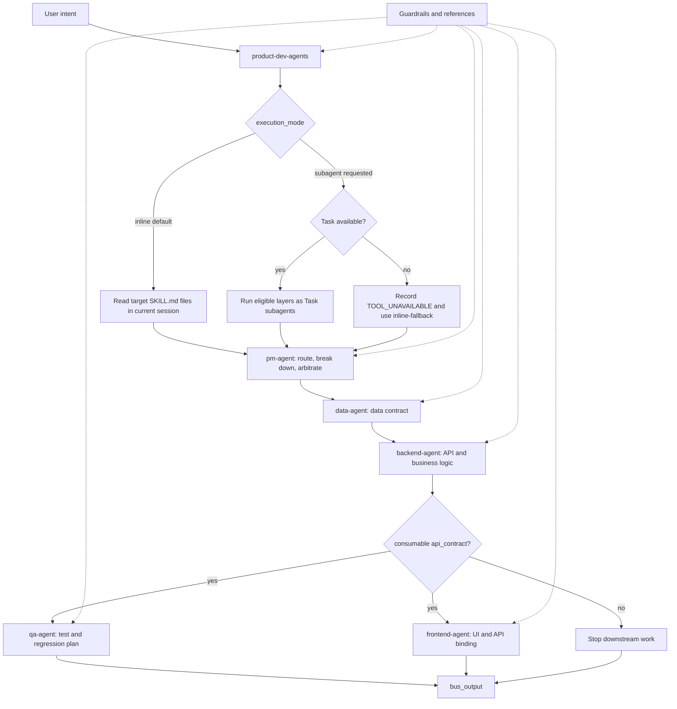

# Product Dev Agents

Product Dev Agents is a contract-driven Codex skill bundle for orchestrating product-development workflows across PM, data, backend, frontend, QA, and project-initialization agents. It keeps a six-agent delivery contract plus orchestration and guardrails while adding v2 dual-mode execution:

- **Default Inline**: read each agent's `SKILL.md` in the current session. This works in environments without Subagent or Task support.
- **Optional Subagent**: pass `execution_mode: subagent` to run eligible layers as Task subagents. If Task is unavailable, the bus records `TOOL_UNAVAILABLE`, falls back to Inline, and sets `bus_output.execution_mode_used: inline-fallback`.

## Repository Layout

```text
.
├── SKILL.md                  # product-dev orchestration bus
├── architect-agent/SKILL.md  # one-time project initialization
├── pm-agent/SKILL.md         # daily product coordination and arbitration
├── data-agent/SKILL.md       # schema, migrations, data contracts
├── backend-agent/SKILL.md    # API design, business logic, OpenAPI contracts
├── qa-agent/SKILL.md         # tests, regression, E2E and performance planning
├── frontend-agent/SKILL.md   # UI implementation and API binding
├── guardrails/               # cross-cutting rules, not delivery agents
│   ├── github-safety/SKILL.md
│   ├── backend-security/SKILL.md
│   └── api-contract-principles/SKILL.md
├── references/contracts.md    # contract index and loading map
├── references/*.md            # handoff, context schema, output, issue contracts
├── schemas/*.schema.json       # machine-readable output, issue, and context schemas
├── agents.yaml                 # authoritative agent registry and dependency map
├── project-context.md        # template for the project context file
└── subagent-orchestration.md # optional Task prompt templates
```

## Orchestration Contract

The execution mode does not change the contract:

1. `data-agent` runs before `backend-agent`.
2. `backend-agent` must complete before `qa-agent` and `frontend-agent` start.
3. Only `qa-agent` and `frontend-agent` may run in parallel, and only after a consumable `api_contract` exists.
4. Handoffs use the fields declared in `pm_output.dispatches` and each layer's `*_output`.
5. Professional agents do not call each other directly. The bus and `pm-agent` route, summarize, and arbitrate conflicts.
6. Any `blocking: true` issue stops downstream work until the issue is resolved or explicitly accepted by the user.
7. If both `qa-agent` and `frontend-agent` run, the bus or pm-agent must perform the integration-check declared in `agents.yaml` before final summary.

## Contract Sources

- `agents.yaml` is the authoritative registry for agent paths, dependencies, produced artifacts, and the QA/frontend integration-check.
- `schemas/*.schema.json` are the machine-readable contracts for issues, project context, bus output, PM output, and professional agent outputs.
- `references/contracts.md` remains the loading index for humans and agents. It points to the schema and policy files that must be used for validation and recovery.
- `references/state-machine.md` defines run and agent lifecycle states.
- `references/artifact-policy.md` defines artifact reporting and contract artifact expectations.
- `references/retry-policy.md` defines recovery and rerun rules.

## Orchestration Diagram



## Usage

Copy or keep this folder where Codex can load skills, then invoke the main bus for product-development work:

```yaml
intent: "YOUR_FEATURE_REQUEST"
execution_mode: inline
```

Use the workspace project's context file if one exists.

Use Subagent mode only when the host environment provides Task/subagent capability:

```yaml
intent: "YOUR_FEATURE_REQUEST"
execution_mode: subagent
```

The default is intentionally Inline so the repository remains compatible with plain Codex sessions and other skill runners.

## Project Context

Use `project-context.md` as the neutral template for the target project's project context file. Replace every `YOUR_...` value with the target project's actual choices. The authoritative schema lives in `schemas/project_context.schema.json`; `references/context-schema.md` explains field responsibility and temporary assumptions. All agents must reject incompatible context versions rather than silently inventing defaults.

## Subagent Prompt Templates

`subagent-orchestration.md` is optional. It is only a Task prompt packaging guide for hosts that support subagents; `SKILL.md` and the files indexed by `references/contracts.md` remain the authority for orchestration behavior and handoff contracts.

## Open Source Notes

This repository is designed to be standalone: all role skills, GitHub safety rules, orchestration contracts, and the project-context template live in this repo. Do not commit private project context, credentials, `.env` files, tokens, customer data, or generated artifacts containing secrets.

## License

MIT. See `LICENSE`.
